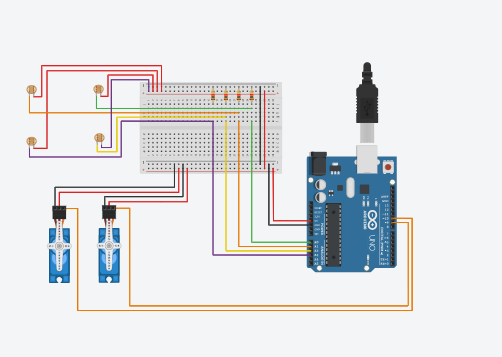

## STEPS (Sun Tracking Energy Panel System)

This project is a simple sun tracking solar panel system using an Arduino UNO. The system adjusts the position of the solar panel to face the sun throughout the day, maximizing the efficiency of solar energy collection.

## Components

- **Arduino UNO** (or any compatible Arduino board)
- **Servo Motors** (2, one for horizontal and one for vertical movement)
- **LDRs** (Light Dependent Resistors) (4, to detect the direction of the light)
- **Resistors** (10k ohms for LDRs)
- **Solar Panel**
- **Breadboard and Jumper Wires**
- **Power Supply** (Battery or USB)

## Circuit Diagram

## Assembly Instructions

1. **LDRs:**
    - Connect each LDR in series with a 10k ohm resistor.
    - Connect the junction of each LDR and resistor to the analog input pins of the Arduino (A0, A1, A2, A3).
    - Connect one end of the LDRs to 5V and the other end of the resistors to GND.

2. **Servos:**
    - Connect the control wires of the servos to PWM pins on the Arduino (D9 and D10).
    - Connect the power and ground pins of the servos to the 5V and GND of the Arduino.

3. **Solar Panel:**
    - Connect the solar panel to a load or a battery for charging/storing the gathered energy.

## Arduino Code

Upload the following code to your Arduino Uno Board via USB Cable.

## Usage

1. Assemble the circuit as per the diagram.
2. Upload the provided code to the Arduino.
3. Power the Arduino and the servos.
4. The solar panel should start tracking the sun, adjusting its position to maximize exposure.

## Troubleshooting

- Ensure all connections are secure.
- Verify the LDRs and resistors are connected correctly.
- Check the servo motor connections and ensure they have sufficient power.

## Acknowledgments

- This project was inspired by various DIY sun tracking systems available online.
- Special thanks to the open-source community for their valuable resources and support.

## Contributing

Contributions are welcome! Please feel free to submit a Pull Request.

---

Feel free to customize this documentation to better fit your project. Add any additional sections or information as needed.

